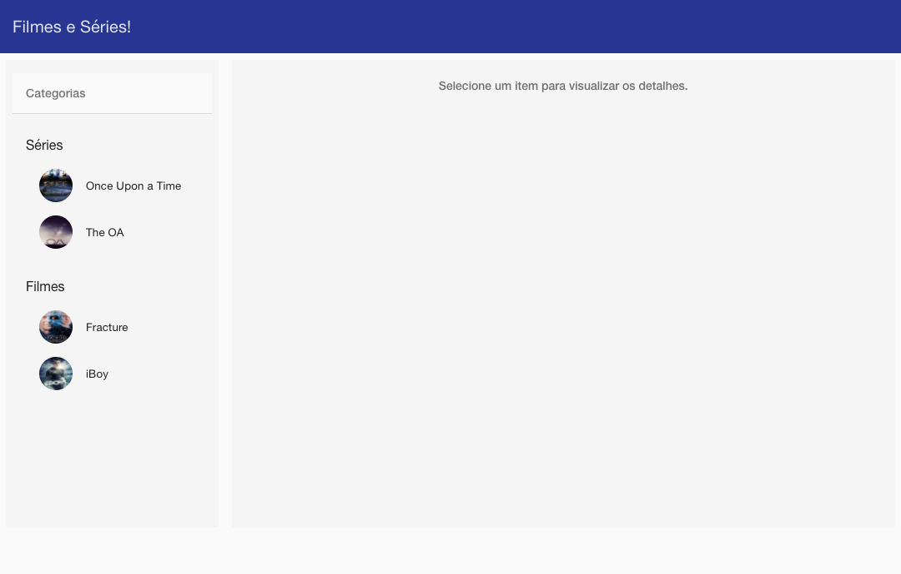
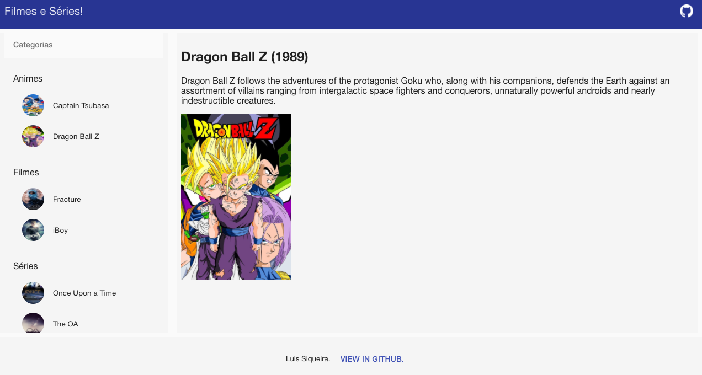

# angular-movies

A sample project made in angular to show series and movies.


## Serve with Python

To serve the project with a python http server.

```
$ python -m SimpleHTTPServer 8000
```

## Screens




