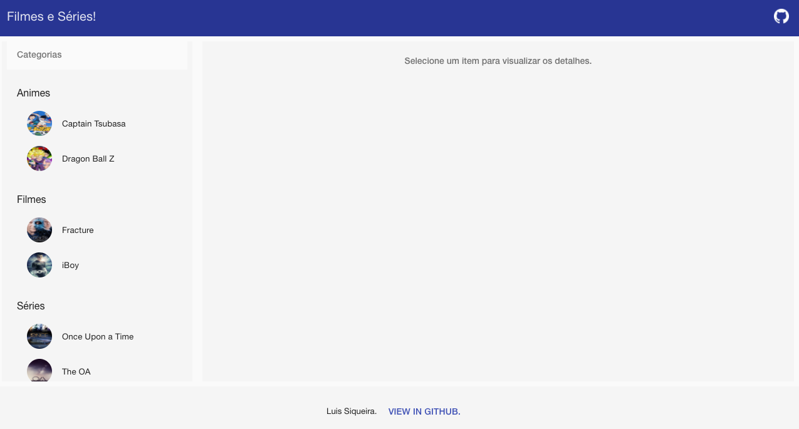
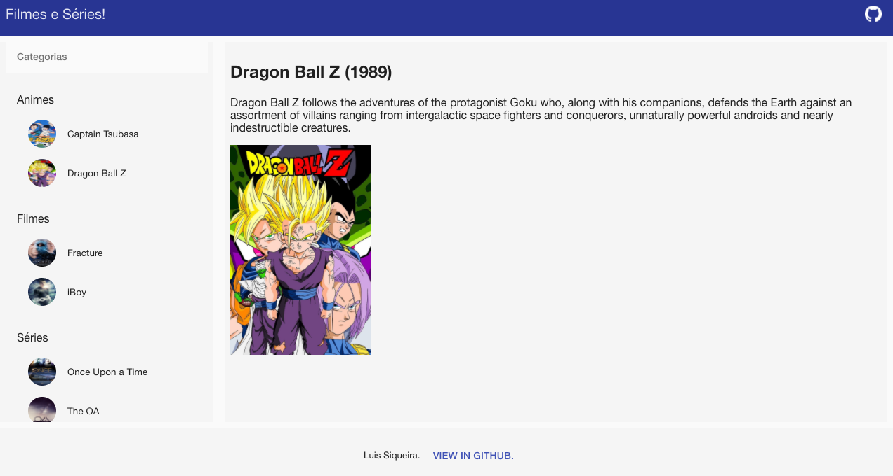

# angular-movies

A sample project made in angular to show series and movies.

## Link on GitHub Pages

https://luissiqueira.github.io/angular-movies/app/#!/

## Used libs

- [Angular Material](https://material.angularjs.org/latest/)
- [AngularUI Router](https://github.com/angular-ui/ui-router)

## Serve with Python

To serve the project with a python http server.

```
$ python -m SimpleHTTPServer 8000
```

## Screens




